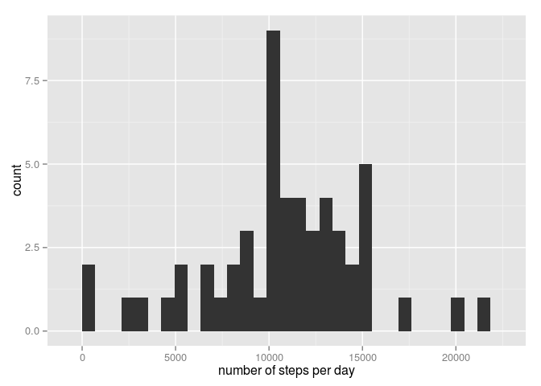

# Reproducible Research: Peer Assessment 1


## Loading and preprocessing the data


```r
# Load and trasform the data
unzip("activity.zip")
activity_data <- read.csv("activity.csv")
activity_data$date <- as.Date(activity_data$date, format="%Y-%m-%d")
```
## What is mean total number of steps taken per day?

```r
# Calculate the total number of steps taken per day
steps_per_day <- aggregate(steps~date, activity_data, sum)
library(ggplot2)
qplot(steps_per_day$steps) + xlab("number of steps per day")
```

 

```r
mean(steps_per_day$steps)
```

```
## [1] 10766.19
```

```r
median(steps_per_day$steps)
```

```
## [1] 10765
```

## What is the average daily activity pattern?

```r
average_daily_activity <- aggregate(steps~interval, activity_data, mean)
ggplot(average_daily_activity, aes(x=interval, y=steps)) + geom_line()
```

 

```r
max(average_daily_activity$steps)
```

```
## [1] 206.1698
```


## Imputing missing values

```r
sum(is.na(activity_data))
```

```
## [1] 2304
```

```r
new_activity_data <- activity_data

f <- function(x){
    if (is.na(x[1])) {
        result <- average_daily_activity[
            average_daily_activity$interval == as.integer(x[3]),2]
    } else {
        result <- x[1]
    }
    as.numeric(result)
}

new_activity_data$steps <- apply(new_activity_data, 1, f)

new_steps_per_day <- aggregate(steps~date, new_activity_data, sum)

#compare_data <- cbind(steps_per_day, new_steps_per_day$steps)
b <- merge(new_steps_per_day, steps_per_day, by="date", all=T)

g <- ggplot(b)
g <- g + geom_histogram(aes(steps.y), alpha=0, colour="red")
g <- g + geom_histogram(aes(steps.x), fill="skyblue", alpha=0.5)
print(g)
```

 


## Are there differences in activity patterns between weekdays and weekends?


```r
Sys.setlocale("LC_TIME", "C")
```

```
## [1] "C"
```

```r
a <- new_activity_data
a$weekday <- as.factor(weekdays(activity_data$date))
a$type <- as.factor(ifelse(a$weekday == "Saturday" |
                               a$weekday == "Sunday", "weekend", "weekday"))
b <- aggregate(steps~interval+type, a, mean)
ggplot(b, aes(x=interval, y=steps, group=type, colour=type)) + geom_line() + facet_wrap(~type, nrow=2)
```

 
